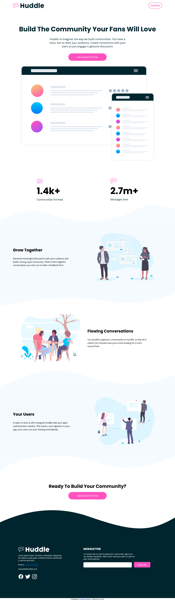

# Frontend Mentor - Huddle landing page with curved sections solution

This is my solution to the [Huddle landing page with curved sections challenge on Frontend Mentor](https://www.frontendmentor.io/challenges/huddle-landing-page-with-curved-sections-5ca5ecd01e82137ec91a50f2).

### Screenshot

### Links

- Solution URL: [Check solution](https://www.frontendmentor.io/solutions/huddle-landing-page-with-curved-sections-dxF0yBf0hx)
- Live Site URL: [Visit LIVE URL](thefacehuddle.netlify.app)

## My process

### Built with

- Semantic HTML5 markup
- CSS custom properties
- JavaScript

## Author

- Portfolio - [Ezekiel The Face](https://thefacecodes.web.app)
- Frontend Mentor - [@iamtheface](https://www.frontendmentor.io/profile/iamtheface)
- Twitter - [@thefacecodes](https://www.twitter.com/thefacecodes)
